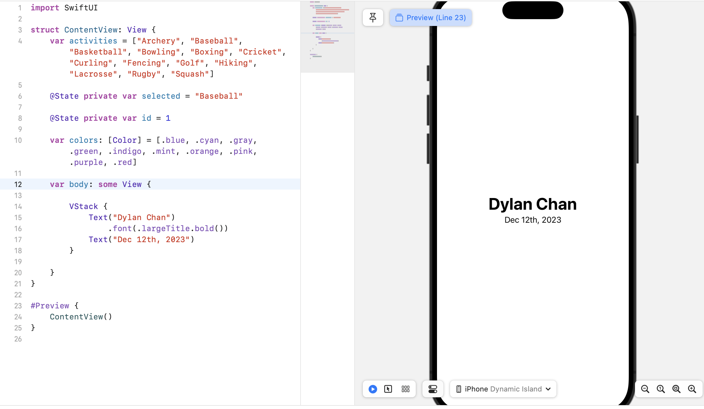
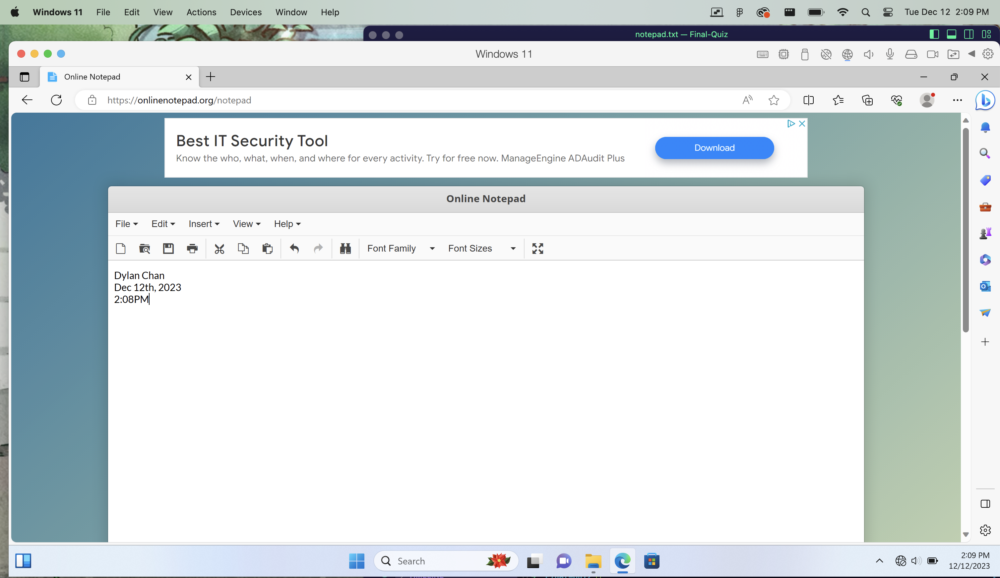

# Dylan_Chan_FinalProject

1.  ``` Christmas Countdown
        function getDaysUntilChristmas() {
        let today = new Date();
        let presentDay = today.getDate();
        let christmas = 25;
        return christmas - presentDay
    }
    console.log("There are", getDaysUntilChristmas(), "days until Christmas!")

2. 

3. 

4. 